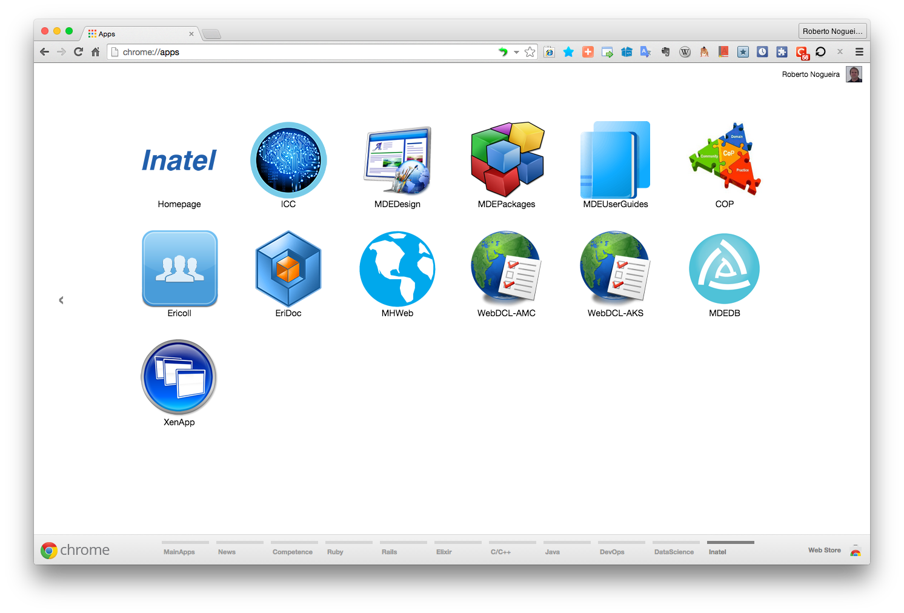

# Chrome Apps for Inatel


## Installation

### 1. Clone this repository and see its contents.
Open a terminal give the following command:

```bash
$ git clone https://github.com/enogrob/ChromeApps_Inatel.git
```

As we can see a subdirectory is created for each Inatel app.

```bash
$ ls -la
drwxr-xr-x@   8 enogrob  staff   272B Jun 19 05:03 ./
drwxr-xr-x+ 142 enogrob  staff   4.7K Jun 18 20:00 ../
:
drwxr-xr-x   20 enogrob  staff   680B Jun 19 05:10 ChromeApps_Inatel/
:

$ tree -L 1 ChromeApps_Inatel/
ChromeApps_Inatel
├── Inatel-COP
├── Inatel-EriDoc
├── Inatel-Ericoll
├── Inatel-Homepage
├── Inatel-ICC
├── Inatel-MDEDB
├── Inatel-MDEDesign
├── Inatel-MDEPackages
├── Inatel-MDEUserGuides
├── Inatel-MHWeb
├── Inatel-WebDCL-AKS
├── Inatel-WebDCL-AMC
├── Inatel-XenApp
├── README.md
└── images

14 directories, 1 file
$
```

### 2. Open Chrome with the following url:
In order to load the `Chrome Apps` for Inatel, check `Developer Mode` and press `Load unpacked extension...` to load each App selecting its corresponding directory inside `ChromeApps_Inatel` e.g. `Inatel-Homepage`, and then repeat that for the wanted apps.

```
chrome://extensions/
```


### 3. After load the Chrome Apps wanted for Inatel, Chrome will look like the screenshot below:



***Notice:*** In order that the `Ericoll` and `EriDoc` sites work properly in Chrome the `IE Tab` extension shall be installed(see below), and in its options e.g. `Auto URLs`, add `*ericoll*` and afterwards `*eridoc*`.

Homepage: [IE Tab](https://chrome.google.com/webstore/detail/ie-tab/hehijbfgiekmjfkfjpbkbammjbdenadd?hl=en-US&utm_source=chrome-ntp-launcher)
